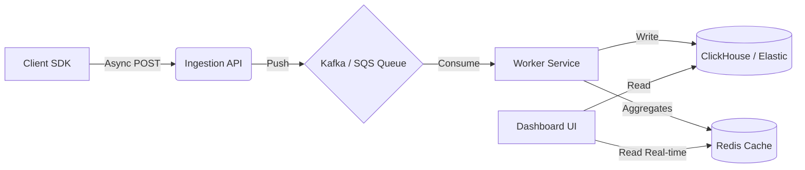

# X-Ray Debugger

A full-stack observability system for debugging non-deterministic pipelines (Search, Filtering, LLMs).

<!--  -->

## ⚡ Quick Start

1. **Install:** `npm install`
2. **Run:** `npm run dev`
3. **Simulate:** Open `http://localhost:3000`. Use the sliders to adjust pipeline parameters (Price/Rating) and click "Run Simulation".
4. **Debug:** Click the link to open the Dashboard (`/dashboard`) and inspect the trace.

## 🏗 Architecture

I chose a **Next.js Monorepo** approach to simulate a realistic production environment while keeping the implementation scoped to the time limit.

- **SDK (`src/lib/xray-sdk.ts`):** A decoupled, zero-dependency class. It uses an `explain()` callback pattern to separate core business logic from observability logic.
- **Backend (`/api/ingest`):** A serverless API route acting as the collector.
- **Storage:** Implemented a custom **Log-Structured Storage Engine** (JSONL) for O(1) ingestion performance.
- **Frontend:** Built with Tailwind CSS + Lucide Icons in **Dark Mode** for a developer-centric DX.
  - Uses a "Subway Map" visualization for high-level flow.
  - Uses "Candidate Cards" to visually debug why specific items (images/products) were rejected.

## 💾 Storage Engine Decision (System Design)

Instead of a naive JSON Array (which incurs an O(N) read/write penalty), I implemented an **Append-Only Log (JSONL)** architecture.

- **Write Performance:** Writes are **O(1)**. The ingestion API simply appends a new line to `traces.jsonl`. This mimics the behavior of high-throughput systems like **Kafka** or **Database Write-Ahead Logs (WAL)**.
- **Simplicity:** Zero external dependencies (no Docker, no SQL drivers) required for the demo.
- **Scalability:** By avoiding full-file rewrites, the ingestion latency remains constant regardless of how much history is stored.

## 🛡️ Reliability & Scale Improvements

Even for this MVP, I implemented core reliability patterns:

1. **Fail-Open SDK:** The SDK implements a "Fail-Open" design with a 2-second timeout circuit breaker. If the observability ingestion service is down or slow, the main application proceeds without crashing or hanging.
2. **Read/Write Separation:** The write path (Ingestion) is optimized for speed (Append-Only). The read path (Dashboard) handles the parsing and slicing (reading last 50 items), ensuring the collector never bottlenecks.

## 🧩 Key Features

- **Granular Decision Tracking:** Unlike standard tracing (latency/errors), X-Ray tracks _why_ items were dropped (e.g., "Price $8.50 < Min $10").
- **Visual Context:** The dashboard renders product thumbnails to help engineers spot "False Positives" (e.g., an accessory being classified as a bottle) instantly.
- **Playground Mode:** The home page allows you to tweak input variables to test the pipeline's robustness dynamically.

## 🚀 Production Vision (Scale)

If deploying this as a production SaaS, I would decouple the ingestion layer to handle high throughput:

